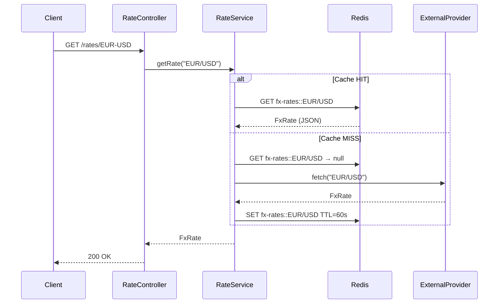

# Chapter 2 — Why you cache, and what can go wrong when you do

> 📦 **Source code:** [`fx-rate-service`](https://github.com/emmanuelgilmont/java-backend-portfolio/tree/main/spring-boot/fx-rate-service)
> in the [java-backend-portfolio](https://github.com/emmanuelgilmont/java-backend-portfolio) repo.

Picture this. Your FX rate endpoint is fine in a demo — one client, one request at a
time. Then it goes live. Twenty clients ask for `EUR/USD` in the same second, and every
single one of them hits the external provider, because there's nothing in between the
controller and the network call. The provider is slow (or rate-limited, or billed per
call), and you just multiplied your load by twenty for information that hasn't changed
since the last request three seconds ago.

The fix is caching. The interesting part isn't "add a cache" — it's what breaks once you
do, and why a cache bug is one of the sneakiest kinds of bug to catch, because a single
manual test almost never reveals it.

## The naive fix (and why it's worth naming, not just skipping)

The obvious first instinct is a hand-rolled check-then-set:

```java
public FxRate getRate(String pair) {
    FxRate cached = myMap.get(pair);
    if (cached != null) {
        return cached;
    }
    FxRate fresh = provider.fetch(pair);
    myMap.put(pair, fresh);
    return fresh;
}
```

It works, technically. But it's the kind of code that quietly grows problems: no TTL
(so a rate from an hour ago looks exactly as fresh as one from ten seconds ago), no
eviction story, and if you're running more than one instance of the service, every
instance has its own private, inconsistent copy of "the cache." None of that is visible
by reading the method — you only discover it in production.

Spring's cache abstraction (`@Cacheable` / `@CacheEvict`) solves the boilerplate part.
Backing it with Redis instead of an in-process map solves the multi-instance part. That
combination is the actual subject of this chapter.

## What actually happens

This is the **cache-aside** pattern — the cache sits beside the read path, not inside
it, and the application is responsible for populating it on a miss:



1. A request comes in for a pair, e.g. `EUR/USD`.
2. Spring's `@Cacheable` intercepts the call and checks Redis first, under a key built
   from the cache name and the method argument.
3. **Hit:** the value comes straight back from Redis. The method body never runs.
4. **Miss:** the method body runs — it calls the external provider — and Spring writes
   the result to Redis with the cache's configured TTL before returning it.
5. `@CacheEvict` removes an entry (or the whole cache) on demand, e.g. for an
   end-of-day reset.

## What the developer actually writes

Same idea as Chapter 1 — the annotation carries the behaviour, the method stays about
the domain:

```java
@Cacheable(value = CacheConfig.CACHE_FX_RATES, key = "#pair.toUpperCase()")
public FxRate getRate(String pair) {
    log.info("Cache MISS for pair {} — fetching from external provider", pair);
    return provider.fetch(pair);
}

@CacheEvict(value = CacheConfig.CACHE_FX_RATES, key = "#pair.toUpperCase()")
public void evictRate(String pair) {
    log.info("Cache evicted for pair {}", pair);
}

@CacheEvict(value = CacheConfig.CACHE_FX_RATES, allEntries = true)
public void evictAll() {
    log.info("fx-rates cache fully cleared");
}
```

[`RateService.java`](https://github.com/emmanuelgilmont/java-backend-portfolio/blob/main/spring-boot/fx-rate-service/src/main/java/be/gate25/fxrate/service/RateService.java#L48-L70)

Two details worth calling out, because they're the kind of thing that's obvious once
you see it and invisible until you go looking:

- **`key = "#pair.toUpperCase()"`** — the cache key is normalised, so `EUR/USD` and
  `eur/usd` hit the same entry. Without this, the cache silently fragments per casing
  variant, and your hit rate quietly tanks for no code-visible reason.
- **The log line lives inside the method body**, so it only fires on a miss. That one
  line is a cheap, permanent way to see your actual hit/miss ratio in production logs
  without adding a metric for it.

## The four pieces that make this work

**[`CacheConfig`](https://github.com/emmanuelgilmont/java-backend-portfolio/blob/main/spring-boot/fx-rate-service/src/main/java/be/gate25/fxrate/config/CacheConfig.java#L46-L74)**
— builds the `RedisCacheManager`, one TTL per named cache (`fx-rates`: 60s,
`fx-rates-meta`: 300s), and configures how values are serialized. This is also where
the bug in the next section lives, which tells you something about where cache bugs
tend to hide: not in the business logic, in the plumbing around it.

**[`RateService`](https://github.com/emmanuelgilmont/java-backend-portfolio/blob/main/spring-boot/fx-rate-service/src/main/java/be/gate25/fxrate/service/RateService.java#L25-L75)**
— the cache-aside logic itself, shown above.

**[`FxRate`](https://github.com/emmanuelgilmont/java-backend-portfolio/blob/main/spring-boot/fx-rate-service/src/main/java/be/gate25/fxrate/domain/FxRate.java#L11-L27)**
— an immutable `record` holding the pair, rate, currencies, and an `Instant fetchedAt`.
That `Instant` is unremarkable in the domain and turns out to be exactly what breaks
serialization — see below.

**[`StubExternalRateProvider`](https://github.com/emmanuelgilmont/java-backend-portfolio/blob/main/spring-boot/fx-rate-service/src/main/java/be/gate25/fxrate/provider/StubExternalRateProvider.java#L37-L58)**
— simulates a slow upstream (80ms latency) and, crucially, counts how many times it was
actually called. That counter is the whole testing strategy below: if the count doesn't
go up, the cache did its job.

## What went wrong (the actual point of this chapter)

Here's the honest version, not the tidied-up-after-the-fact version. `CacheConfig`
serializes cache values as JSON via Jackson. The first version of that config used a
plain `ObjectMapper` with no extra setup. `FxRate.fetchedAt` is a `java.time.Instant`,
and a default `ObjectMapper` doesn't know how to serialize that type — it throws.

The failure mode is what makes this genuinely nasty: it doesn't fail loudly, it fails
*silently correct-looking*. A single `curl` against the endpoint returns a perfectly
valid rate, because the exception happens on the *write* to Redis, after the value has
already been computed and is on its way back to the client as a 200. The cache write
just never lands — so Redis is permanently empty, every request is a miss, and the
external provider gets called on every single request. The cache exists in the code and
does nothing in production. Nobody notices from the outside; the numbers are always
right, they're just never fast.

What actually surfaced it was flat p50/p95/p99 latency lines on a Grafana dashboard —
if every call takes the same ~80ms regardless of repetition, there's no such thing as a
cache hit happening. The fix:

```java
ObjectMapper redisObjectMapper = new ObjectMapper();
redisObjectMapper.registerModule(new JavaTimeModule());
redisObjectMapper.disable(SerializationFeature.WRITE_DATES_AS_TIMESTAMPS);
```

[`CacheConfig.java#L56-L69`](https://github.com/emmanuelgilmont/java-backend-portfolio/blob/main/spring-boot/fx-rate-service/src/main/java/be/gate25/fxrate/config/CacheConfig.java#L56-L69)

Fixing that surfaced a second, more subtle one. `GenericJackson2JsonRedisSerializer`
needs default typing turned on to know what Java type to deserialize a JSON blob back
into — it embeds a `@class` field in the JSON for that purpose. With
`DefaultTyping.NON_FINAL`, that embedding is asymmetric for `record` types, because
records are implicitly `final` in Java: writes silently *omit* the type envelope at the
root (since the type looks "final" and supposedly needs no envelope), but reads still
*expect* one. That produces an intermittent deserialization failure — specifically on
the second read of a given key, once you'd expect a hit. Switching to
`DefaultTyping.EVERYTHING` fixed it, at the cost of a slightly larger JSON payload per
cached entry (an acceptable trade for correctness here).

The `BasicPolymorphicTypeValidator` restricted to `be.gate25.fxrate.domain`,
`java.math`, and `java.time` is the other half of that same config — polymorphic typing
with no restriction on which classes it'll deserialize into is a known deserialization
attack surface for `GenericJackson2JsonRedisSerializer`; scoping it to the app's own
packages closes that off without giving up the type-safety you need for the round-trip.

## Testing strategy — two layers

Same principle as the batch project (Chapter 4): **test behaviour locally, test
infrastructure in CI.** A cache has two genuinely separate things to verify, and
conflating them either slows down every `mvn test` with Docker or leaves the real
storage layer untested.

### Layer 1 — `RateServiceCacheTest` (local, no Docker)

Active profile `test` swaps Redis for Caffeine, an in-process cache — same Spring Cache
abstraction, zero infrastructure. Assertions read the provider's call counter, not the
cache directly:

| Scenario | Assertion |
|---|---|
| First call | Provider called once (miss) |
| Second call, same pair | Provider **not** called again (hit) |
| `EUR/USD` vs `eur/usd` | Same cache entry (key normalisation) |
| `evictRate()` | That pair misses again; others still hit |
| `evictAll()` | Every pair misses again |
| Unknown pair | `UnsupportedPairException`, and it isn't cached |

[`RateServiceCacheTest.java`](https://github.com/emmanuelgilmont/java-backend-portfolio/blob/main/spring-boot/fx-rate-service/src/test/java/be/gate25/fxrate/RateServiceCacheTest.java#L44-L124)

### Layer 2 — `RateServiceRedisIT` (CI, Docker required)

`@Testcontainers(disabledWithoutDocker = true)` starts a real `redis:7.2-alpine`
container; `@DynamicPropertySource` wires its host/port into the Spring context. Same
scenarios as Layer 1, plus one Layer 1 structurally cannot cover:

```java
@Test
@DisplayName("Cached FxRate survives Redis serialization round-trip")
void cachedValue_shouldSurviveSerializationRoundTrip() {
    FxRate original = rateService.getRate("USD/JPY");  // stored in Redis
    FxRate cached   = rateService.getRate("USD/JPY");  // retrieved from Redis

    assertThat(cached.pair()).isEqualTo(original.pair());
    assertThat(cached.rate()).isEqualByComparingTo(original.rate());
    ...
}
```

[`RateServiceRedisIT.java#L164-L175`](https://github.com/emmanuelgilmont/java-backend-portfolio/blob/main/spring-boot/fx-rate-service/src/test/java/be/gate25/fxrate/RateServiceRedisIT.java#L164-L175)

That test is exactly the one the two bugs above would have caught, had it existed
first — it was added after hunting down the `JavaTimeModule` bug through Grafana, not
before. The lesson holds regardless of the ordering: real JSON serialization only gets
exercised by the Docker-gated layer, so a serialization bug can pass a plain `mvn test`
clean unless that layer specifically asserts on the round-tripped value, not just on
hit/miss behaviour.

## Interview questions worth being ready for

**"Cache-aside vs. read-through — what's the actual difference?"**
Cache-aside (what's here) puts the application in charge: on a miss, *the application*
fetches from the source of truth and writes to the cache. Read-through pushes that
responsibility into the caching layer itself, which fetches on your behalf. Cache-aside
is simpler to reason about and is what Spring's `@Cacheable` gives you for free; a
read-through setup usually means a purpose-built caching library or a proxy in front of
the data source.

**"What happens if twenty requests for the same missing key arrive at once?"**
Worth naming directly: nothing in this implementation prevents a cache stampede — all
twenty could miss and all twenty could hit the external provider simultaneously before
any of them populates the cache. Mitigations exist (locking around the fetch, a
short-lived "in-flight" marker, request coalescing) but they add real complexity, and
they're not implemented here. I'd bring this up unprompted in an interview rather than
wait to be asked, because pretending it isn't a gap is worse than naming it.

**"Why `GenericJackson2JsonRedisSerializer` and not Java serialization?"**
JSON is human-readable in `redis-cli` — you can debug a cache issue by looking straight
at the stored value — and it doesn't carry the JVM class-versioning fragility that
`java.io.Serializable` does across app redeploys. The trade-off is exactly what this
chapter is about: JSON needs an `ObjectMapper` that's actually configured correctly for
your types, or it fails in ways a happy-path test won't catch.

---

*Next: [Chapter 3 — What happens between two threads when you call a service](./03-grpc-price-service.md)*
